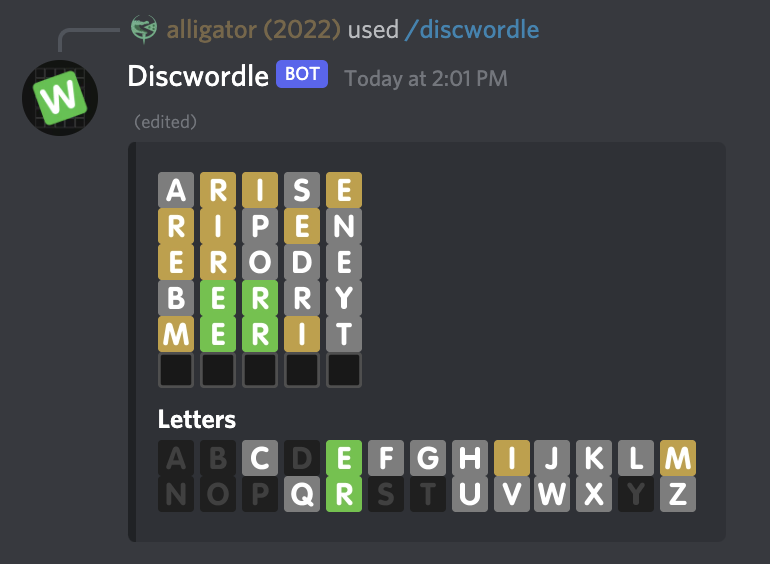

# Discwordle
Play Wordle with your friends on your Discord server

## Invite
[Add Discwordle to your server!](https://discord.com/api/oauth2/authorize?client_id=929196686243397672&permissions=264192&scope=bot%20applications.commands)

## About
Discwordle is a simple bot that plays as many games of [Wordle](https://www.powerlanguage.co.uk/wordle/) as your heart desires. Currently, all players cooperate on the same board, with everyone getting the maximum six guesses.

## Commands

`/discwordle (wordLength)` - starts a game of Discwordle, optionally specifying how long the word should be. Defaults to the classic 5 length. Issue this command at anytime to send a new message with the board, useful if the original has scrolled way out of view.

`/guess (word)` - guesses a word.

## Future Enhancements

Competitive mode? Board is hidden, and all guesses are shown only to the player who sent them. Race to be the first?

Have any others? Open an issue and let me know!

## Thanks

Word list and some code used from [hello wordl](http://foldr.moe/hello-wordl/) ([Github](https://github.com/lynn/hello-wordl)), a great Wordle clone!